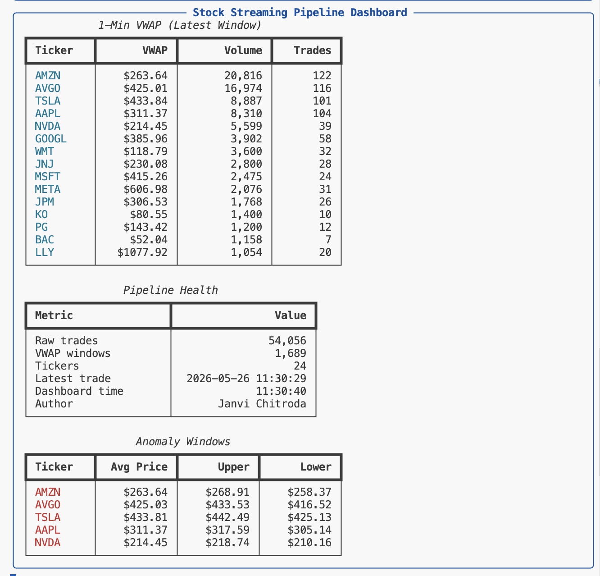
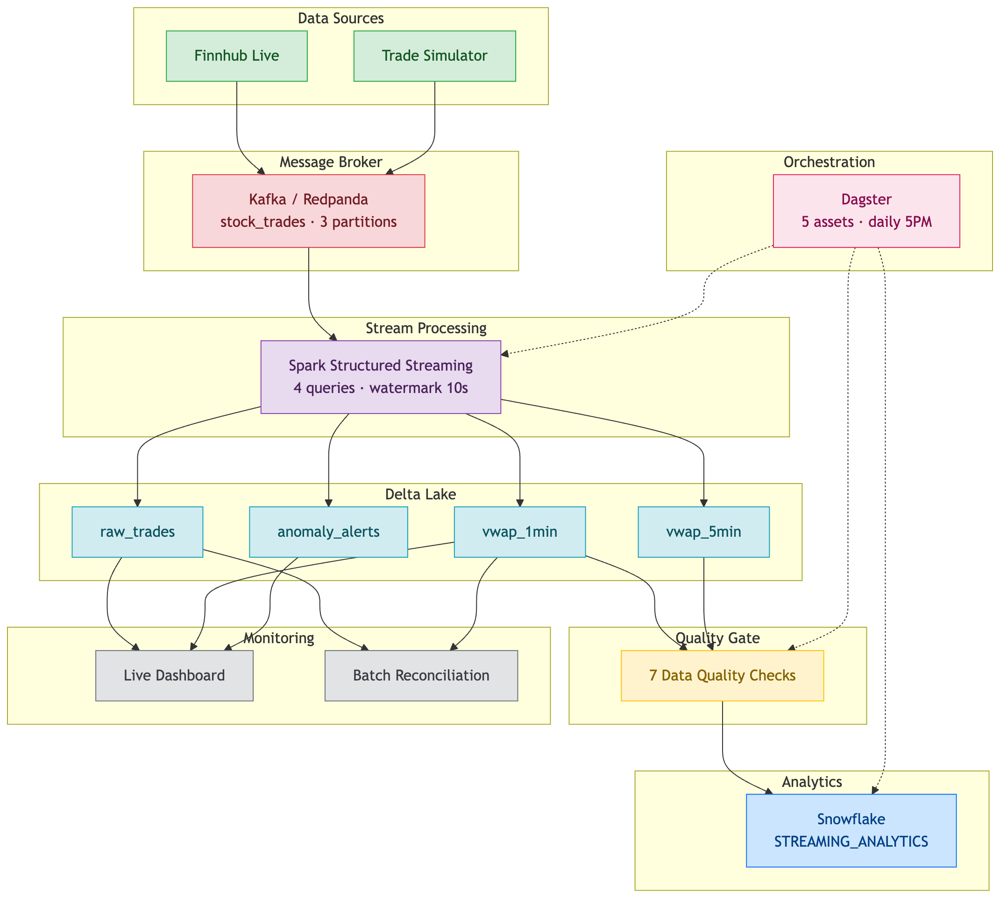
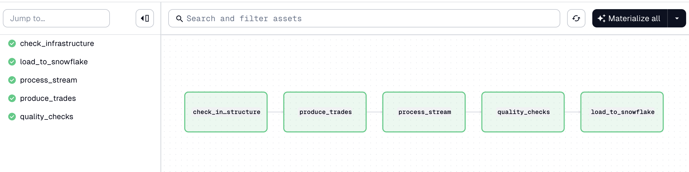
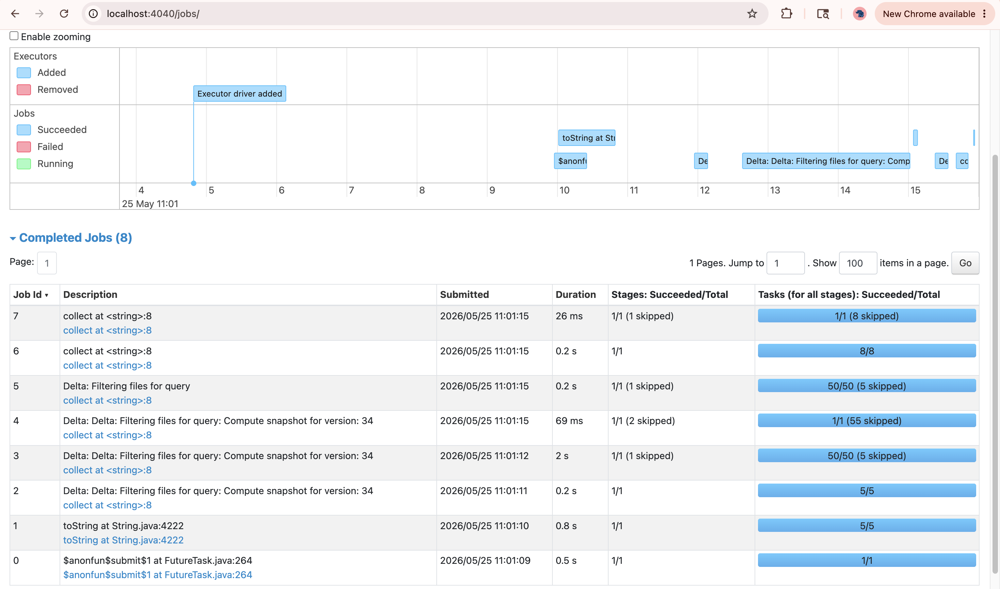

# Kafka → Spark Structured Streaming → Delta Lake → Dagster → Snowflake

**Author:** [Janvi Chitroda](https://github.com/JanviChitroda24)

A production-style real-time stock trade pipeline: ingest live market events via Kafka (Redpanda), process with Spark Structured Streaming, store in Delta Lake with exactly-once semantics, orchestrate with Dagster, and load analytics into Snowflake.

**Companion project (batch):** [dbt Financial KPIs](https://github.com/JanviChitroda24/dbt-financial-kpis) — same 25 tickers, batch SQL transforms vs this streaming pipeline.

---

## Live Dashboard



Real-time VWAP, pipeline health, and anomaly bounds — refreshes every 15 seconds while the pipeline runs.

```bash
cd src && python live_dashboard.py
```

---

## Architecture



> Source: [`diagrams/architecture.mermaid`](diagrams/architecture.mermaid) · Also available: [`architecture.svg`](diagrams/architecture.svg)

**Layers at a glance:** Finnhub / simulator → Redpanda → Spark (4 queries) → Delta Lake (4 tables) → DQ checks → Snowflake. Dagster orchestrates the production path; dashboard and reconciliation run on-demand.

| Layer | Technology | Role |
|-------|------------|------|
| Message broker | Redpanda (Kafka-compatible) | Durable event log, ticker-partitioned |
| Stream engine | PySpark Structured Streaming | VWAP, watermarks, anomaly bounds |
| Storage | Delta Lake | ACID tables, checkpoints, time travel |
| Orchestration | Dagster | Asset DAG, retries, Mon–Fri schedule |
| Warehouse | Snowflake | Serving layer for analytics |
| Live data | Finnhub WebSocket | Real trades (simulator fallback) |

**Dagster asset graph:**



---

## What It Does

- **Ingests** 25 mega-cap tickers (AAPL, MSFT, NVDA, …) via Finnhub live feed or a realistic simulator (~100 events/sec)
- **Streams** 4 parallel Structured Streaming queries from one Kafka source with independent checkpoints
- **Computes** VWAP, buy pressure, trade counts at 1-min and 5-min granularity
- **Detects** anomaly bounds (±2% from window average) and flags individual outlier trades
- **Orchestrates** end-to-end runs: infra check → produce → process → DQ gates → Snowflake load
- **Validates** with batch reconciliation, SIGKILL recovery test, integration test, and 13 unit tests

---

## Quick Start

### Prerequisites

- Python 3.11+
- Docker Desktop
- Java 11+ (for Spark)
- 8 GB RAM recommended

### Setup

```bash
git clone https://github.com/JanviChitroda24/kafka-spark-streaming-pipeline.git
cd kafka-spark-streaming-pipeline

python -m venv .venv
source .venv/bin/activate
pip install -r requirements.txt

# Create .env with Finnhub + Snowflake credentials (see Configuration below)
docker compose up -d
```

### Run manually (3 terminals)

```bash
# Terminal 1 — producer
cd src
python producer.py --mode simulated --eps 50 --duration 120

# Terminal 2 — Spark processor (4 Delta sinks)
python stream_processor.py

# Terminal 3 — live dashboard
python live_dashboard.py
```

### Run via Dagster (one-click production path)

```bash
# From repo root
dagster dev -f dagster_pipeline/definitions.py -d .
# Open http://localhost:3000 → Materialize all
```

### One-command smoke test

```bash
cd src
python integration_test.py   # ~75 seconds, validates all 4 Delta tables
```

---

## Delta Tables

| Table | Layer | Description |
|-------|-------|-------------|
| `raw_trades` | Bronze | Append-only trade event log |
| `vwap_1min` | Silver | 1-minute VWAP per ticker |
| `vwap_5min` | Silver | 5-minute VWAP per ticker |
| `anomaly_alerts` | Gold | Window avg price + ±2% bounds |

Path: `data/delta/` (gitignored — generated at runtime)

---

## Project Structure

```
kafka-spark-streaming-pipeline/
├── src/                    # Producer, processor, loaders, operational tools
├── dagster_pipeline/       # 5 Dagster assets + schedule
├── tests/                  # pytest (trade simulator, VWAP logic)
├── docs/                   # Generated reports (reconciliation, recovery, DQ, etc.)
├── diagrams/               # Architecture screenshots, Spark UI, live dashboard
├── docker-compose.yml      # Redpanda + Console (localhost:8080)
├── requirements.txt
└── .env                    # Secrets (never commit)
```

---

## Key Scripts

### Core pipeline

| Script | Purpose |
|--------|---------|
| `producer.py` | Unified CLI — simulated / Finnhub / auto mode |
| `stream_processor.py` | 4 streaming queries → Delta |
| `snowflake_loader.py` | Load Delta tables → Snowflake |
| `data_quality_checks.py` | 7 validations, exit code 1 on fail |

### Operational tools (Mode 3 — on-demand)

| Script | Purpose |
|--------|---------|
| `live_dashboard.py` | Real-time terminal dashboard (rich) |
| `batch_reconciliation.py` | Batch VWAP vs streaming — target >99% match |
| `integration_test.py` | End-to-end smoke test, all 4 tables |
| `recovery_test.py` | SIGKILL crash + dedup verification |
| `anomaly_detector.py` | Individual outlier trades vs window bounds |
| `spark_tuning_demo.py` | Skew, salting, broadcast join demo |
| `check_duplicates.py` | Inspect duplicate trade_ids after recovery |

### Dagster assets (Mode 2 — automated)

```
check_infrastructure → produce_trades → process_stream → quality_checks → load_to_snowflake
```

---

## Verification Results

| Test | Result |
|------|--------|
| Integration test | ✅ All 4 Delta tables populated (89K+ raw trades) |
| Batch reconciliation | ✅ 100% match rate (473/473 windows) |
| Recovery test (SIGKILL) | ✅ Zero data loss after dedup on `trade_id` |
| Unit tests | ✅ 13/13 passing (`pytest tests/`) |
| Data quality | ✅ 7/7 checks (`data_quality_checks.py`) |

Reports: `docs/integration_test_report.md`, `docs/reconciliation_report.md`, `docs/recovery_test_report.md`

---

## Spark UI

While `stream_processor.py` runs, inspect execution plans at [http://localhost:4040](http://localhost:4040):



---

## Three Ways to Run

| Mode | When | How |
|------|------|-----|
| **Manual** | Development, learning | 3 terminals: Docker + producer + processor |
| **Dagster** | Daily automated load | Materialize all in Dagster UI |
| **Operational** | Monitoring, validation | Dashboard, reconciliation, integration test |

---

## Configuration

Central config: `src/config.py`

| Setting | Default | Notes |
|---------|---------|-------|
| Kafka bootstrap | `localhost:19092` | Redpanda external port |
| Spark trigger | 10 seconds | Micro-batch interval |
| Watermark | 10 seconds | Late data tolerance |
| Anomaly threshold | 2% | Window avg ± bounds |
| Tickers | 25 | Same universe as [dbt project](https://github.com/JanviChitroda24/dbt-financial-kpis) |

Environment variables (`.env`):

```
FINNHUB_API_KEY=your_key
SNOWFLAKE_ACCOUNT=...
SNOWFLAKE_USER=...
SNOWFLAKE_PASSWORD=...
SNOWFLAKE_WAREHOUSE=MARKET_DATA_WH
```

---

## Ports

| Service | URL |
|---------|-----|
| Redpanda Kafka | `localhost:19092` |
| Redpanda Console | [http://localhost:8080](http://localhost:8080) |
| Dagster UI | [http://localhost:3000](http://localhost:3000) |
| Spark UI | [http://localhost:4040](http://localhost:4040) |

---

## Batch vs Streaming (This Project vs dbt)

| Aspect | [dbt Financial KPIs](https://github.com/JanviChitroda24/dbt-financial-kpis) | This repo |
|--------|-----------------------------------------------------------------------------|-----------|
| Data arrival | Daily batch | Continuous stream |
| Processing | SQL on full tables | Windowed aggregations |
| Latency | Hours | Seconds |
| Storage | Snowflake | Delta Lake → Snowflake |
| Failure mode | Re-run full day | Checkpoint + exactly-once |

---

## Troubleshooting

| Issue | Fix |
|-------|-----|
| `Cannot reach Kafka` | `docker compose up -d` and wait for healthy Redpanda |
| Spark Java error | Install Java 11+ (`java -version`) |
| Empty Delta tables | Run producer before processor; check Redpanda Console for messages |
| Dashboard shows `<rich.table.Table object>` | Use `rich.console.Group` (fixed in latest `live_dashboard.py`) |
| Dagster import errors | Run from repo root: `dagster dev -f dagster_pipeline/definitions.py -d .` |
| Recovery test duplicates | Expected edge case — run `check_duplicates.py`, dedup on read |

---

## Documentation

Detailed hour-by-hour walkthrough: [de-learning-notes / 03_streaming_Notes.md](https://github.com/JanviChitroda24/de-learning-notes) (companion repo)

Generated reports in `docs/`:

- `streaming_vs_batch_comparison.md`
- `kafka_partitioning.md`
- `pipeline_health_report.md`
- `anomaly_detection_report.md`
- `spark_tuning_report.md`
- `data_quality_report.md`

---

## Tech Stack

PySpark 3.5 · Delta Lake 3.1 · kafka-python · Redpanda · Dagster 1.13 · Snowflake · Finnhub WebSocket · rich · pytest

---

*Built by [Janvi Chitroda](https://github.com/JanviChitroda24) — MS Information Systems, Northeastern University · Data Engineer*
